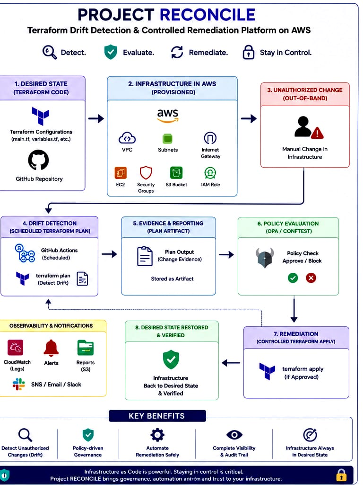
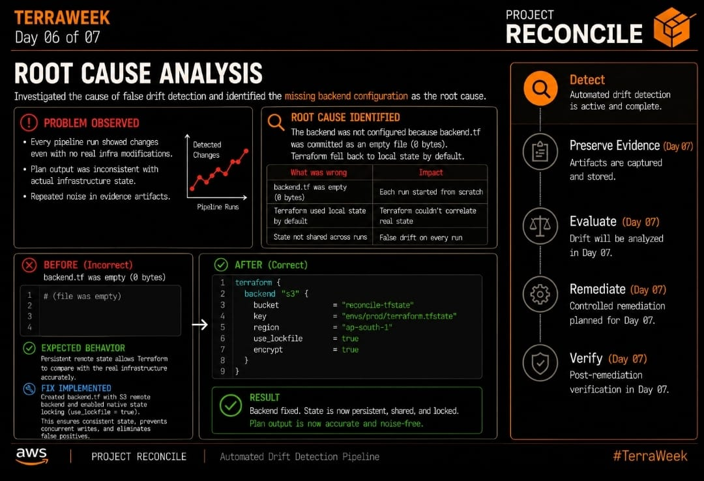

# PROJECT RECONCILE

### Terraform Drift Detection and Controlled Remediation on AWS

PROJECT RECONCILE demonstrates how infrastructure drift can be detected, evaluated, approved, and remediated safely using Terraform, GitHub Actions, AWS, and Open Policy Agent.

Instead of blindly running terraform apply the moment a difference appears, PROJECT RECONCILE builds a controlled reconciliation workflow that preserves evidence, evaluates policy, requires human approval for high-risk changes, and verifies the final infrastructure state.

This repository documents the complete engineering journey from an empty repository to a fully operational reconciliation platform, built over seven days as part of TerraWeek, including the real bugs found and fixed along the way.

Terraform defines what infrastructure should look like. AWS runs what actually exists. The problem begins when those two views stop matching.

A Security Group rule gets changed manually. A route gets updated during troubleshooting. An EC2 configuration gets modified directly in the console. The infrastructure keeps running, but the environment no longer matches what's stored in source control.

Detect to Preserve Evidence to Evaluate to Remediate to Verify

## Architecture

This diagram is the architecture actually built across TerraWeek. The AWS infrastructure baseline, drift detection, evidence capture, policy evaluation, and controlled remediation are all live, and every stage has been verified end to end in a real run, not just designed on paper.

## The Problem

Infrastructure changes outside Terraform more often than most teams would like to admit.

Emergency production fixes. Manual console changes. Security Group tweaks. Route modifications. Temporary troubleshooting changes that quietly never get reverted.

Terraform will eventually notice the difference. But noticing isn't the same as understanding it. Was the change intentional. Does it introduce risk. Should Terraform restore the original state, or should the code catch up because the change was actually legitimate. And what evidence existed before anyone touched anything.

PROJECT RECONCILE treats detection as the start of the process, not the finish line.

## Reconciliation Workflow

| Stage | Responsibility |
| :--- | :--- |
| Detect | Compare Terraform configuration with infrastructure observed in AWS |
| Preserve Evidence | Capture Terraform plan output before infrastructure is changed |
| Evaluate | Assess the detected change against policy and approval controls |
| Remediate | Reconcile approved changes through Terraform |
| Verify | Confirm that infrastructure has returned to the approved state |

## Current AWS Baseline

| AWS Component | Current Implementation |
| :--- | :--- |
| VPC | 10.0.0.0/16 |
| DNS | DNS support and DNS hostnames enabled |
| Public Subnet | us-east-1a |
| Public IP Mapping | Enabled |
| Internet Gateway | Attached to the project VPC |
| Route Table | Default route through the Internet Gateway |
| Security Group | SSH restricted to the operator IP |
| IAM | EC2 role and instance profile, dedicated least-privilege CI user |
| Systems Manager | AmazonSSMManagedInstanceCore attached |
| EC2 | Amazon Linux 2023 |
| Root Volume | 30 GB |
| S3 | Versioning, AES256 encryption, native state locking |
| Terraform State | Remote, shared, and locked in S3 |

## Infrastructure State Model

PROJECT RECONCILE works with three views of infrastructure.

| View | What it represents |
| :--- | :--- |
| Terraform Configuration | The intended infrastructure |
| Terraform State | Infrastructure currently managed by Terraform |
| AWS Infrastructure | Resources observed through the AWS provider |

Drift shows up the moment these three views stop agreeing with each other.

## Repository Structure
 "Modules are separated...
project-reconcile/
main.tf
variables.tf
outputs.tf
providers.tf
modules/
vpc/
s3/
security_group/
iam/
ec2/
opa/
policies/
scripts/
.github/
workflows/
docs/
images/
day-01/
day-02/
day-03/
day-04/
day-05/
day-06/
day-07/
README.md
 "Modules are separated...
## TerraWeek Build Journey

PROJECT RECONCILE was built across the seven days of TerraWeek. Each day's scope landed on the same project instead of living in an isolated lab.

| Day | Focus | PROJECT RECONCILE |
| :---: | :--- | :--- |
| 01 | Terraform and IaC Foundation | Project architecture, repository structure and Terraform foundation |
| 02 | HCL and AWS Infrastructure | VPC, subnet, Internet Gateway, routing and S3 state foundation |
| 03 | Resources and Dependencies | Security Group, IAM role, instance profile and EC2 deployment |
| 04 | Terraform State | Remote state and native S3 state locking |
| 05 | Modules and Provider Design | Reusable infrastructure and module refinement |
| 06 | Automation and CI/CD | Scheduled drift detection and Terraform plan evidence |
| 07 | Drift and Remediation | Policy evaluation, approval, controlled remediation and verification |

## Day 01 | Project Foundation

The first day was about direction, not infrastructure.

Defined the PROJECT RECONCILE architecture. Verified the Terraform CLI and AWS CLI authentication. Set up the repository structure and AWS provider. Added version constraints for Terraform and the provider. Parameterized the region and environment. Kept state and working files out of source control from day one.

No AWS resources went up yet. The point was a clean foundation before anything got provisioned.

## Day 02 | AWS Network and State Foundation

Day 02 was the first real infrastructure design.

Built a reusable VPC module around the 10.0.0.0/16 network. Created the public subnet in us-east-1a, attached an Internet Gateway, and wired up the default route. Built the S3 state storage module with versioning, AES256 encryption, and blocked public access. Exposed outputs for the modules that would need them later.

Terraform's plan came back at 9 to add, 0 to change, 0 to destroy. Nothing was applied yet on purpose. The plan itself was the thing worth reviewing first.

## Day 03 | Compute and Access Layer

This is where PROJECT RECONCILE stopped being a plan and became real infrastructure.

Created the EC2 Security Group with SSH locked to one operator IP. Built the IAM role and instance profile, attached AmazonSSMManagedInstanceCore as a fallback access path, and deployed the EC2 module running Amazon Linux 2023.

The first apply failed. The root volume was set to 8 GB, and the Amazon Linux 2023 AMI snapshot needed at least 30. Terraform planned it fine, AWS's API rejected it at creation time.

That was a useful failure. A clean plan doesn't guarantee the cloud provider will actually accept every value in it. The volume got bumped to 30 GB, and the second apply went through.

## Day 04 | Terraform State

Day 04 moved everything to remote state.

Migrated to an S3 backend and turned on native locking with use_lockfile = true, which meant no separate DynamoDB lock table was needed. Verified state stayed consistent after the migration and confirmed concurrent runs couldn't collide.

A real bug turned up here: backend.tf had been committed as a completely empty file. Terraform had nothing to point to, so it quietly fell back to local state instead of throwing an error. Once caught, the backend was restored and the pipeline was confirmed to be reading and writing against the actual shared state, not a local copy pretending to be one.
## Day 05 | Reusable Infrastructure

This day was about tightening the design before adding more on top of it.

Reviewed module boundaries, refined inputs and outputs, and removed coupling that had crept in early on. Improved the provider configuration and confirmed modules could actually be reused, not just referenced once and forgotten.

The goal was reusability without hiding important resource relationships behind abstraction for its own sake.

## Day 06 | Drift Detection Automation

Day 06 is where the project's real purpose kicked in.

Set up a scheduled GitHub Actions workflow running terraform plan every 6 hours, plus a manual dispatch trigger for on-demand checks. Created a dedicated least-privilege IAM user, reconcile-ci, so the pipeline wasn't running with broad credentials. Every plan got uploaded as a GitHub Actions artifact, building an actual audit trail instead of just console output that disappears.

Found and fixed a real bug where backend.tf had been committed empty, which meant the pipeline had been comparing against local state instead of the shared remote backend the whole time.

Full writeup: docs/day-06/README.md

By the end of Day 06, the drift detection pipeline was scheduled, repeatable, and validated against real AWS infrastructure, not an approximation of it.

## Day 07 | Controlled Remediation

The final day connected the whole loop: not just detecting drift, but deciding what to do about it and proving the fix actually worked.

Wrote OPA and Rego policy, evaluated through Conftest, to auto-approve safe drift like EC2 public IP or DNS changes and require manual approval for anything sensitive, like security groups, IAM, or S3. OPA was chosen specifically because policy decisions can evolve independently of Terraform code, so approval logic can change without touching infrastructure modules at all.

Split the pipeline into two jobs: drift-check, which plans and evaluates, and apply, which only runs if drift is detected and only after a human approves it. Built a production-apply GitHub Environment with a required reviewer, and confirmed through the deployment status history that the gate genuinely pauses execution rather than waving things through.

Every early apply attempt failed with the same error: Cannot apply incomplete plan. The real cause turned out to be that AWS's provider reads back a wide set of S3 bucket sub-configurations on every refresh, and the CI user only had a narrow list of read permissions. Each fix just unblocked the next AccessDenied error in line. The actual fix was replacing that narrow list with a scoped s3 Get all actions wildcard restricted to just the one bucket, which closed the gap in one pass instead of five.

A second, smaller gap showed up right after: changing an EC2 instance's user_data requires Terraform to stop and restart it, which needed StopInstances, StartInstances, and ModifyInstanceAttribute permissions that hadn't been granted yet.

With both fixed, a fresh attended run went the distance. Deliberate test drift was introduced, the pipeline caught it, evaluated it, and paused for approval. The deployment was approved, terraform apply ran against the exact approved plan, and came back with:

Apply complete. Resources 0 added, 1 changed, 0 destroyed.

A post-apply verification plan ran right after:

No changes. Your infrastructure matches the configuration.

Full writeup: docs/day-07/README.md

## Security Approach

SSH is restricted to the configured operator IP, and port 22 is never open to the world. AWS Systems Manager gives a fallback path that doesn't depend on SSH at all. EC2 permissions run through an IAM instance role, not hardcoded credentials. State storage uses versioning and AES256 encryption, with public access blocked. State files are excluded from source control entirely. CI execution runs on a dedicated least-privilege IAM user, scoped to only what the pipeline actually needs, nothing more.

## Failures and Fixes

Real engineering means real failures. Here is what actually broke, and how it got fixed.

| Issue | Root Cause | Resolution |
| :--- | :--- | :--- |
| EC2 creation failed | Root volume was smaller than the AMI snapshot required | Increased root volume from 8 GB to 30 GB |
| False drift on every run | backend.tf was committed as an empty file | Restored proper S3 backend configuration |
| CI plan failed on state refresh | Missing s3 GetBucketPolicy permission | Added the permission to the CI IAM policy |
| CI plan failed again on a different resource read | Missing s3 GetBucketCORS and related read permissions | Replaced narrow permission list with a scoped s3 wildcard on the state bucket |
| Apply failed while updating EC2 | Missing ec2 StopInstances, StartInstances, and ModifyInstanceAttribute | Added the three permissions needed for the stop-modify-start cycle |
| Approval gate needed proof it actually worked | No verification that the pause was real, not cosmetic | Confirmed via GitHub deployment status history that the gate genuinely holds for review |

## Project Status

| Capability | Status |
| :--- | :---: |
| Project Foundation | Complete |
| AWS Network Foundation | Complete |
| State Storage Foundation | Complete |
| EC2 Compute Layer | Complete |
| IAM and SSM Integration | Complete |
| AWS Infrastructure Baseline | Complete |
| Remote State and Locking | Complete |
| Drift Detection | Complete |
| Evidence Preservation | Complete |
| Policy Evaluation | Complete |
| Controlled Remediation | Complete |
| End to End Verification | Complete |

## What Comes Next

PROJECT RECONCILE now has what it didn't have on Day 01: a real Terraform-managed AWS baseline, an automated drift detection pipeline, policy-based evaluation, an approval-gated remediation flow, and a verified end-to-end reconciliation loop, not just a diagram of one.

The full cycle has been proven in a live, attended run. Drift was introduced, detected, evaluated, approved, remediated, and verified clean.

What's next: hardening the policy set for a wider range of resource types, extending evidence retention, and exploring automated approval for a broader class of genuinely low-risk changes.

Built as part of TerraWeek.

Detect to Preserve Evidence to Evaluate to Remediate to Verify
