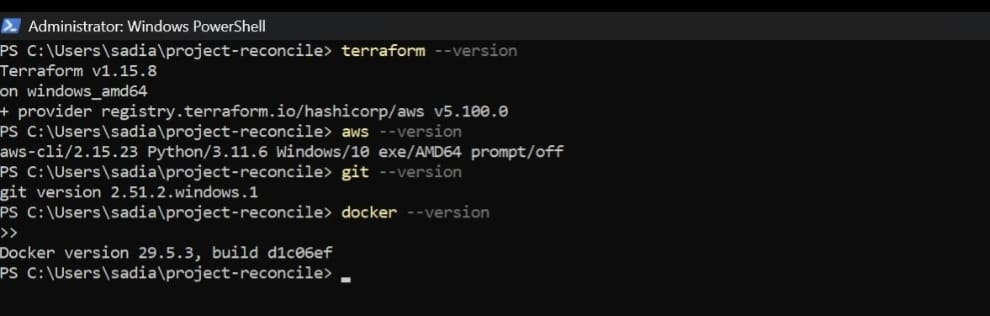

# TerraWeek Day 01 | Terraform and Infrastructure as Code

Day 01 was about understanding the Terraform workflow and preparing the foundation for PROJECT RECONCILE.

Instead of creating an isolated Terraform example, I used the day's concepts to start the infrastructure codebase for the project.

## Learning Summary

The first day covered the fundamentals of Infrastructure as Code and Terraform.

The main areas explored were:

• Infrastructure as Code

• Terraform and its declarative model

• HashiCorp Configuration Language

• Terraform providers

• Terraform resources

• Terraform state

• Terraform modules

• The Terraform execution workflow

## Infrastructure as Code

Infrastructure as Code is the practice of defining and managing infrastructure through configuration files rather than relying entirely on manual changes.

The infrastructure definition becomes version controlled and repeatable.

For PROJECT RECONCILE, Terraform configuration represents the desired state of the AWS environment.

When the actual AWS infrastructure no longer matches that configuration, infrastructure drift exists.

## Why Terraform

Terraform was selected for PROJECT RECONCILE because the project is centered around Terraform state, infrastructure planning and drift detection.

Terraform uses a declarative model.

The configuration describes the expected infrastructure. Terraform compares that configuration with the infrastructure it manages and determines the actions required to reach the expected state.

## Terraform Terminology

| Terminology | Description |
| :--- | :--- |
| Provider | Plugin used by Terraform to communicate with platforms such as AWS |
| Resource | Infrastructure object managed by Terraform |
| State | Terraform's record of managed infrastructure |
| Plan | Preview of infrastructure changes Terraform intends to perform |
| Apply | Executes approved infrastructure changes |
| HCL | HashiCorp Configuration Language used to define Terraform configuration |
| Module | Reusable collection of Terraform resources |

## Terraform Workflow

| Step | Command | Purpose |
| :---: | :--- | :--- |
| 1 | terraform init | Initialize the Terraform working directory |
| 2 | terraform fmt | Format Terraform configuration |
| 3 | terraform validate | Validate the configuration |
| 4 | terraform plan | Review proposed infrastructure changes |
| 5 | terraform apply | Execute approved infrastructure changes |
| 6 | terraform destroy | Remove Terraform managed infrastructure when required |

The workflow separates configuration validation, change review and infrastructure execution.

That separation becomes important later in PROJECT RECONCILE when detected drift must be reviewed before remediation.

## PROJECT RECONCILE Foundation

The first day was used to establish the project structure and Terraform foundation.

Work completed:

• Defined the PROJECT RECONCILE concept

• Designed the initial drift detection and remediation architecture

• Created the GitHub repository

• Verified Terraform CLI availability

• Verified AWS CLI availability

• Configured the AWS provider

• Added Terraform version constraints

• Added AWS provider version constraints

• Created the root Terraform configuration

• Added variables for AWS region and deployment environment

• Added Terraform outputs

• Protected Terraform working files through gitignore

## Terraform and AWS CLI Verification

The local tools were verified before starting the Terraform configuration.

Terraform CLI and AWS CLI were available from PowerShell and ready for the project workflow.

## Provider Configuration

The AWS provider establishes communication between Terraform and AWS.

The provider configuration uses a variable for the AWS region rather than fixing the region directly in the configuration.

This allows the same Terraform configuration to be reused across environments.

## Variables and Environment Configuration

The project began with configurable values for:

• AWS region

• Deployment environment

The environment variable forms part of the infrastructure naming and tagging strategy.

This provides a foundation for development, test and production environments from the same Terraform codebase.

## Repository Foundation

The initial project structure was prepared as follows:

    project-reconcile/
    │
    ├── main.tf
    ├── variables.tf
    ├── outputs.tf
    ├── providers.tf
    ├── modules/
    ├── docs/
    └── README.md

The modules directory was reserved for reusable AWS infrastructure components introduced during the following TerraWeek days.

## Terraform Initialization and Validation

The Terraform working directory was initialized and the configuration was validated.

The Terraform workflow used during verification included:

    terraform init
    terraform fmt
    terraform validate

The configuration passed Terraform validation successfully.

## Day 01 Result

| Check | Result |
| :--- | :---: |
| Terraform CLI | Verified |
| AWS CLI | Verified |
| Terraform Provider | Configured |
| Project Variables | Configured |
| Repository Structure | Created |
| Terraform Validation | Success |
| AWS Resources Deployed | No |

No AWS infrastructure was deployed on Day 01.

The objective was to establish the project structure, Terraform workflow and infrastructure design before provisioning resources.

## What I Took Away

Terraform is not simply an AWS resource creation tool.

The configuration represents infrastructure intent.

The plan shows the proposed difference.

The state records what Terraform manages.

The provider communicates with the actual platform.

PROJECT RECONCILE will operate around the relationship between these components.

Day 01 established that foundation.

## Next

Day 02 moves PROJECT RECONCILE into AWS infrastructure design.

The next stage introduces the VPC, public subnet, Internet Gateway, routing and the S3 state storage foundation.

[Back to PROJECT RECONCILE](../../README.md)
