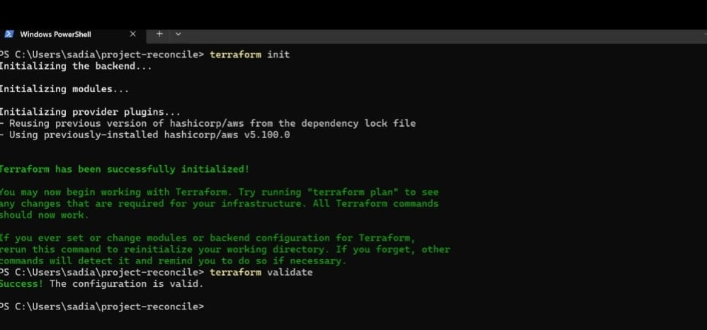
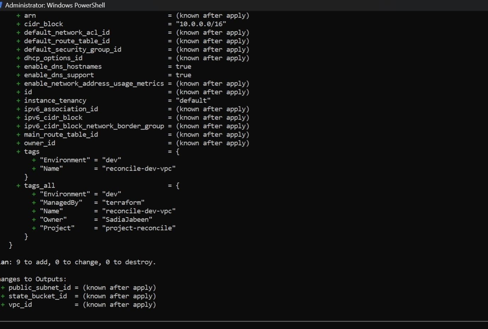

# TerraWeek Day 02

## Terraform Configuration Language and AWS Infrastructure Planning

Day 02 focused on moving PROJECT RECONCILE from the initial Terraform foundation into AWS infrastructure design.

The objective was to understand how Terraform configuration is structured and then translate the first infrastructure requirements of the project into Terraform resources.

## Infrastructure planned

The initial AWS foundation includes:

* VPC with CIDR 10.0.0.0/16
* Public subnet in us-east-1a
* Internet Gateway
* Public route table
* Route to the Internet Gateway
* S3 bucket prepared for Terraform remote state

These resources form the base infrastructure on which the remaining PROJECT RECONCILE components will be deployed.

## Terraform workflow

The configuration was checked using the standard Terraform workflow.

terraform fmt

terraform validate

terraform plan

Terraform validate confirmed that the configuration was syntactically valid.

Terraform plan was then used to review the proposed infrastructure changes before any resources were created.

## What I understood today

Terraform configuration defines the desired infrastructure state.

Variables allow the configuration to remain reusable.

Providers connect Terraform with the target platform.

Terraform plan shows the difference between the current state and the desired state before changes are applied.

For PROJECT RECONCILE, this comparison is important because the same principle will later be used to identify infrastructure drift.

## PROJECT RECONCILE connection

Infrastructure drift begins when the real AWS environment no longer matches the Terraform configuration.

Day 02 established the AWS infrastructure definition that will act as the desired state for the project.

The next stages will build the AWS resources and eventually introduce drift detection around this desired state.

## Next

Day 03 introduces the security and compute layer with Security Groups, IAM roles, Instance Profiles and EC2.

[Back to PROJECT RECONCILE](../../README.md)
