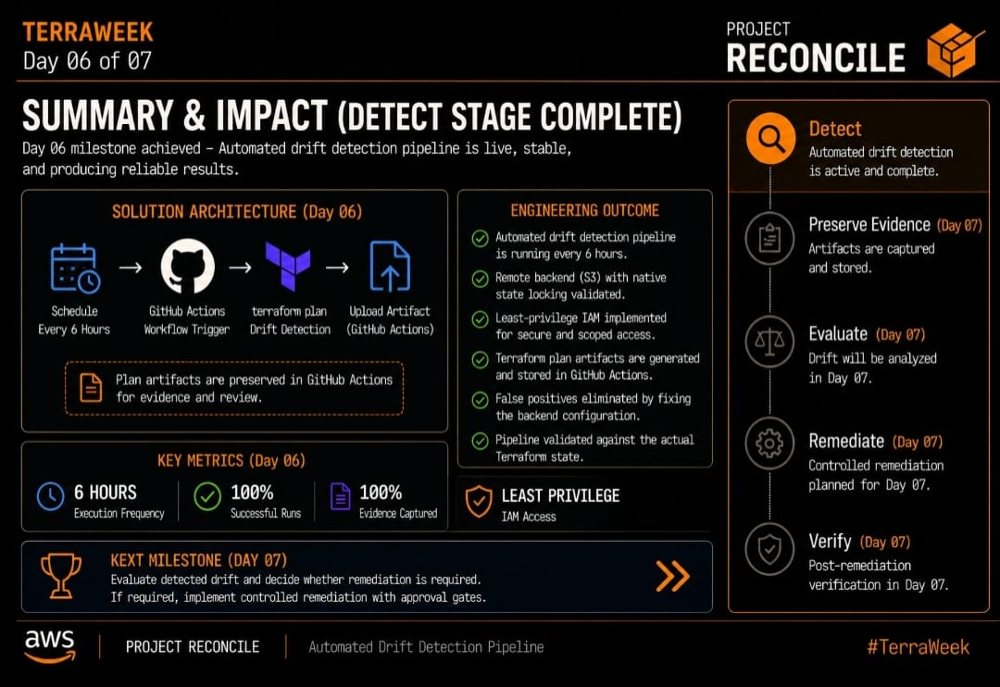

# Day 06 | Drift Detection Automation

Day 06 moved PROJECT RECONCILE toward its primary purpose: catching infrastructure drift without a human having to remember to look for it.

## What Was Built

Scheduled GitHub Actions workflow running terraform plan every 6 hours

Manual dispatch trigger for on-demand validation

Dedicated least-privilege IAM user, reconcile-ci, scoped only to what the pipeline actually needs

Automatic upload of every plan as a GitHub Actions artifact, building an auditable execution history

## The Bug That Almost Broke Everything Quietly

During validation, plan output kept flagging changes even when nothing had actually changed in AWS.

The cause: backend.tf had been committed as an empty file. Terraform had no remote backend to point to, so it silently fell back to local state. The pipeline was running successfully every time, but comparing against the wrong source of truth.

The fix was to restore the correct S3 backend configuration, add native state locking with use_lockfile = true, and add the missing s3:GetBucketPolicy permission the CI user needed for state refresh.

Once fixed, plan output was clean and consistent for the first time.

## Result

By the end of Day 06, PROJECT RECONCILE had a drift detection pipeline that was scheduled, repeatable, evidence-generating, and validated against real AWS infrastructure, not a local approximation of it.

Next: Day 07 teaches the pipeline to evaluate what it detects, and decide what can be remediated automatically versus what needs a human's approval.
